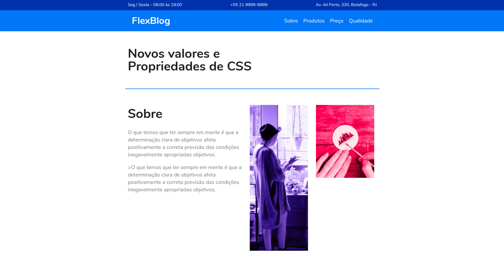

<h1 align="center">Origamid flexbox</h1>

<h3>Página simples feita com html e css para estudar conceitos do flexbox.</h3>

  

---
By [Rodrigo Sakamoto](https://www.linkedin.com/in/rodrigo-sakamoto/)